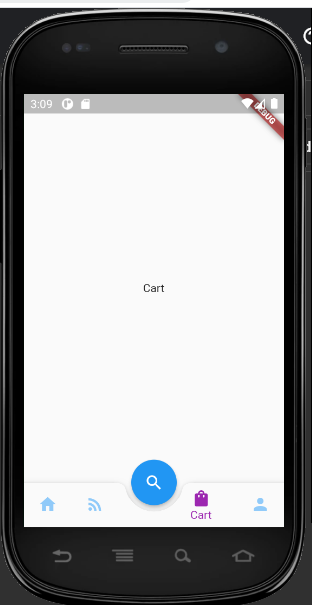
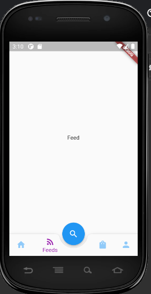
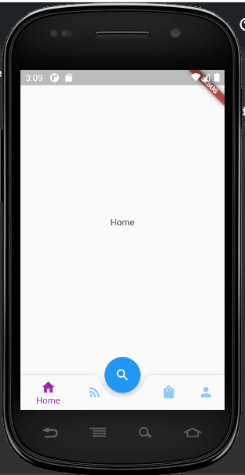
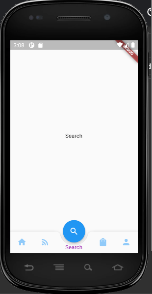
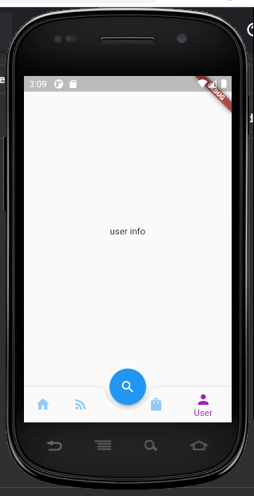
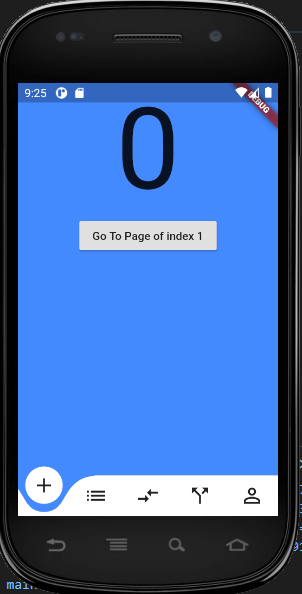
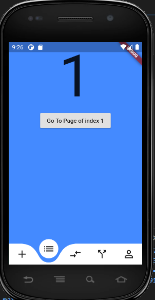
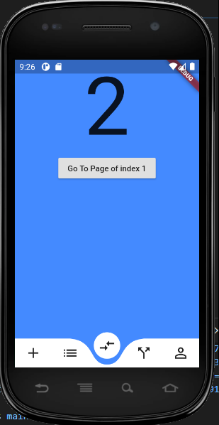
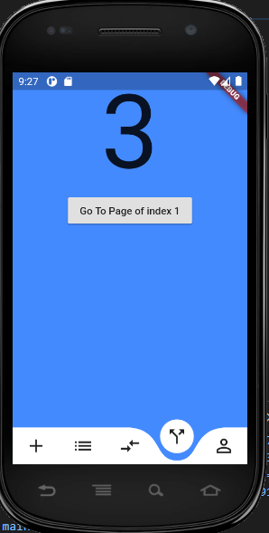
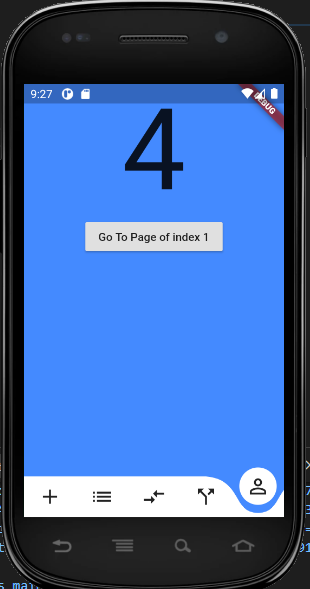

# Bottom Navigation

Flutter project for bottom navigation bar. There are 2 samples in this project.
1. BottomAnimatedBar
2. BottomBarScreen

# Example
Make changes in main.dart file 
1. Simple
```
home: BottomBarScreen());
```

2. Animated
```
home: BottomAnimatedBar());
```

## Simple Bottom Bar Screenshot






## Animated Bottom Bar Screenshot





